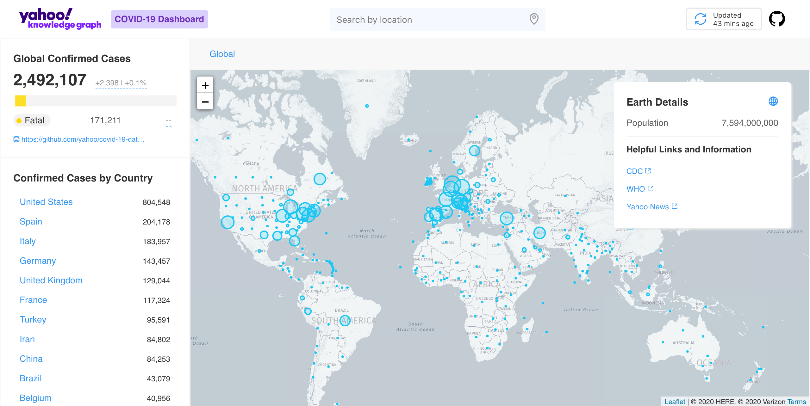

# Yahoo Knowledge Graph COVID-19 Dashboard [![Pipeline Status][status-image]][status-url]

## Background

This repository contains source code for the [Yahoo Knowledge Graph COVID-19 Dashboard](https://yahoo.github.io/covid-19-dashboard). The visualization is powered by [Elide](https://github.com/yahoo/elide) and themed with [Denali Design](https://github.com/denali-design).

Related project links:

- [Public API](https://github.com/yahoo/covid-19-api/) powered by [Elide](https://elide.io/)
- [Hourly dataset updates](https://github.com/yahoo/covid-19-data/) from public sources
- Open datasets ([commercial use upon request](https://docs.google.com/forms/d/e/1FAIpQLSdINfXR6S0ZmOGSvdvg4WUKzhqvDxltLoa4q4btQ4gkJokTPw/viewform))

## Install locally

1. Clone the repo `git clone https://github.com/yahoo/covid-19-dashboard.git`

2. Install dependencies `npm i`

3. Configure the environment

   > Note that by default, the app will run with mock data (via [mirage](https://miragejs.com/)) enabled.
   >
   > To use real data in local development you must supply the url of a `COVID_API` [host](https://github.com/yahoo/covid-19-api/#install-locally)
   > The following environment variables are available
   > | ENV | default | run local |
   > |-------------------------|----------------------------------------------------|-----------------------|
   > | COVID_API | https://covid19.knowledge.yahoo.com | http://localhost:8080 |
   > | TILE_SERVER | https://{s}.tile.openstreetmap.org/{z}/{x}/{y}.png | |
   > | TILE_SERVER_ATTRIBUTION | osmAttribution | |

4. Start the server `ember s` or `npm run start`

   > So to run the api and dashboard locally you might run `COVID_API=http://localhost:8080 npm run start`

## Maintainers

- [Jon Kilroy](https://www.linkedin.com/in/jon-kilroy-52545b4/)
- [Aaron Klish](https://www.linkedin.com/in/aaron-klish-005927/)
- [Balaji Manoharan](https://www.linkedin.com/in/balaji-manoharan-08006018/)
- [Kevin Hinterlong](https://www.linkedin.com/in/kevinhinterlong/)

Please contact yk-covid-19-os@verizonmedia.com with any questions.

## License

This project is licensed under the terms of the Apache 2.0 open source license. Please refer to LICENSE in the project root for the full terms.

[status-image]: https://cd.screwdriver.cd/pipelines/4627/badge
[status-url]: https://cd.screwdriver.cd/pipelines/4627
